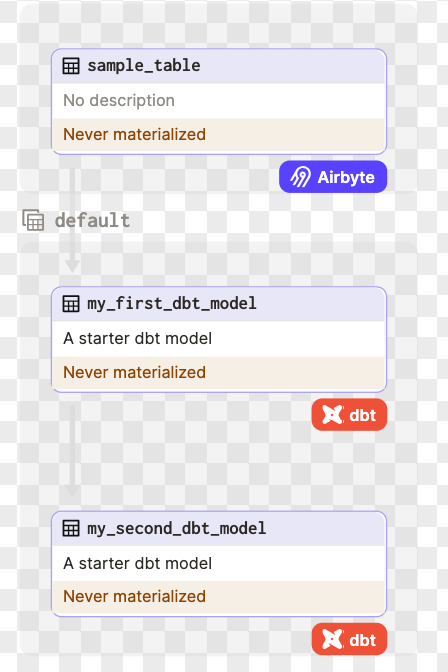

<p align="center">
  
</p>
<p align="center">
    <h1 align="center">Data Engineer - E(xtract)L(oad)T(ransform) Pipeline (Airbyte-Snowflake-dbt-Dagster) </h1>
</p>
<p align="center">
		<em>Developed with the tools and platforms below.</em>
</p>
<p align="center">
	
	
	
    
</p>
<hr>

## Table of Contents

- [Airbyte-dbt-Dagster-Snowflake Integration](#airbyte-dbt-dagster-snowflake-integration)
  - [Overview](#overview)
  - [Database Sample](#database-sample)
  - [Table of Contents](#table-of-contents)
  - [Pipeline DAG](#pipeline-dag)
  - [Prerequisites](#prerequisites)
  - [1. Setting an environment for your project](#1-setting-an-environment-for-your-project)
  - [2. Setting Up Airbyte Connectors](#2-setting-up-airbyte-connectors)
  - [3. Setting Up the dbt Project](#3-setting-up-the-dbt-project)
  - [4. Orchestrating with Dagster](#4-orchestrating-with-dagster)
  - [Next Steps](#next-steps)

## Overview
This repo provides a quickstart template for building a full data stack using Airbyte, Dagster, dbt, and Snowflake. Easily extract data from Microsoft SQL Server and load it into Snowflake using Airbyte, and apply necessary transformations using dbt, all orchestrated seamlessly with Dagster.

## Database Sample
For this project, I use AdventureWorks2022 OLTP sample data from Microsoft to mimic operational data in the real world

Link to the bak file and the download instruction is [here](https://learn.microsoft.com/en-us/sql/samples/adventureworks-install-configure?view=sql-server-ver16&tabs=ssms)


## Pipeline DAG


## Prerequisites

Before you embark on this integration, ensure you have the following set up and ready:

1. **Python 3.10 or later**: If not installed, download and install it from [Python's official website](https://www.python.org/downloads/).

2. **Docker and Docker Compose (Docker Desktop)**: Install [Docker](https://docs.docker.com/get-docker/) following the official documentation for your specific OS.

3. **Airbyte OSS version**: Deploy the open-source version of Airbyte. Follow the installation instructions from the [Airbyte Documentation](https://docs.airbyte.com/quickstart/deploy-airbyte/).

4. **Dagster**: Dagster will help orchestrate the ELT pipeline from ingesting to transforming data. If you haven't installed it, follow the [official Dagster installation guide](https://docs.dagster.io/getting-started/install).


## 1. Setting an environment for your project

Get the project up and running on your local machine by following these steps:

1. **Clone the repository (Clone only this quickstart)**:  
   ```bash
   git clone https://github.com/khoa9/DataEngineer_Airbyte_dbt_Snowflake_Dagster.git
   ```
   
2. **Navigate to the directory**:  
   ```bash
   cd DataEngineer_Airbyte_dbt_Snowflake_Dagster
   ```

3. **Set Up a Virtual Environment**:  
   - For Mac:
     ```bash
     python3 -m venv venv
     source venv/bin/activate
     ```
   - For Windows:
     ```bash
     python -m venv venv
     .\venv\Scripts\activate
     ```

4. **Install Dependencies**:  
   ```bash
   pip install -e ".[dev]"
   ```

## 2. Setting Up Airbyte Connectors

Airbyte allows you to create connectors for sources and destinations, facilitating data synchronization between various platforms.

Following the instruction in this [Airbyte official link](https://docs.airbyte.com/using-airbyte/getting-started/oss-quickstart) to run in on localhost and set up your data source and destination data


## 3. Setting Up the dbt Project

[dbt (data build tool)](https://www.getdbt.com/) allows you to transform your data by writing, documenting, and executing SQL workflows. Setting up the dbt project requires specifying connection details for your data platform, in this case, Snowflake. Here’s a step-by-step guide to help you set this up:

1. **Navigate to the dbt Project Directory**:

   Change to the directory containing the dbt configuration:
   ```bash
   cd ../../snowflake_datawarehouse
   ```

2. **Update Connection Details**:

   You'll find a `profiles.yml` file within the directory. This file contains configurations for dbt to connect with your data platform. Update this file with your Snowflake connection details.

3. **Utilize Environment Variables (Optional but Recommended)**:

   To keep your credentials secure, you can leverage environment variables. An example is provided within the `profiles.yml` file.

4. **Test the Connection**:

   Once you’ve updated the connection details, you can test the connection to your Snowflake instance using:
   ```bash
   dbt debug
   ```

   If everything is set up correctly, this command should report a successful connection to Snowflake.

## 4. Orchestrating with Dagster

[Dagster](https://dagster.io/) is a modern data orchestrator designed to help you build, test, and monitor your data workflows. In this section, we'll walk you through setting up Dagster to oversee both the Airbyte and dbt workflows:

1. **Navigate to the Orchestration Directory**:

   Switch to the directory containing the Dagster orchestration configurations:
   ```bash
   cd ../../datawarehouse_dagster
   ```

2. **Set Environment Variables**:

   Dagster requires certain environment variables to be set to interact with other tools like dbt and Airbyte. Set the following variables:

   ```bash
   export DAGSTER_DBT_PARSE_PROJECT_ON_LOAD=1
   export AIRBYTE_PASSWORD=password
   ```
   
   Note: The `AIRBYTE_PASSWORD` is set to `password` as a default for local Airbyte instances. If you've changed this during your Airbyte setup, ensure you use the appropriate password here.

3. **Launch the Dagster UI**:

   With the environment variables in place, kick-start the Dagster UI:
   ```bash
   dagster-webserver
   ```

4. **Access Dagster in Your Browser**:

   Open your browser and navigate to:
   ```
   http://127.0.0.1:3000
   ```

   Here, you should see assets for both Airbyte and dbt. To get an overview of how these assets interrelate, click on "view global asset lineage". This will give you a clear picture of the data lineage, visualizing how data flows between the tools.

## Next Steps

Once you've set up and launched this initial integration, the real power lies in its adaptability and extensibility. Here’s a roadmap to help you customize and harness this project tailored to your specific data needs:

1. **Create dbt Sources for Airbyte Data**:

   Your raw data extracted via Airbyte can be represented as sources in dbt. Start by [creating new dbt sources](https://docs.getdbt.com/docs/build/sources) to represent this data, allowing for structured transformations down the line.

2. **Add Your dbt Transformations**:

   With your dbt sources in place, you can now build upon them. Add your custom SQL transformations in dbt, ensuring that you treat the sources as an upstream dependency. This ensures that your transformations work on the most up-to-date raw data.

3. **Execute the Pipeline in Dagster**:

   Navigate to the Dagster UI and click on "Materialize all". This triggers the entire pipeline, encompassing the extraction via Airbyte, transformations via dbt, and any other subsequent steps.

4. **Extend the Project**:

   The real beauty of this integration is its extensibility. Whether you want to add more data sources, integrate additional tools, or enhance your transformation logic – the floor is yours. With the foundation set, sky's the limit for how you want to extend and refine your data processes.